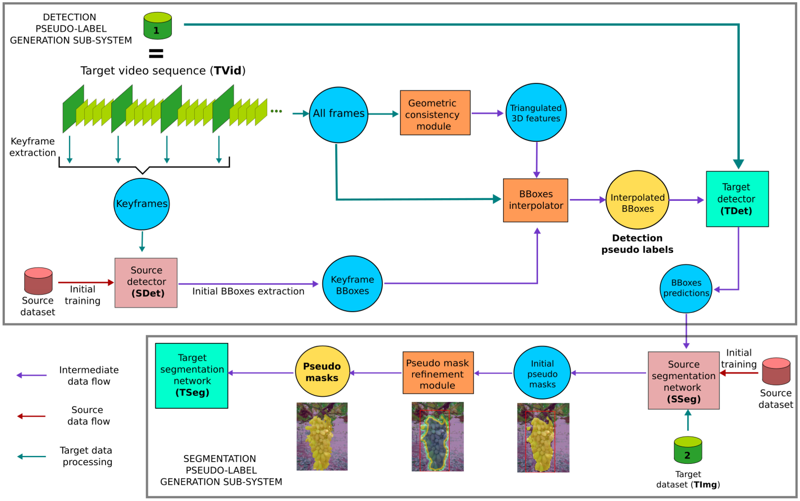

# pseudo-label-generation
This repository contains the code related to the approaches described in these papers: 
 * [Pseudo-label Generation for Agricultural Robotics Applications](http://openaccess.thecvf.com/content/CVPR2022W/AgriVision/html/Ciarfuglia_Pseudo-Label_Generation_for_Agricultural_Robotics_Applications_CVPRW_2022_paper.html)
 * [Weakly and semi-supervised detection, segmentation and tracking of table grapes with limited and noisy data](https://www.sciencedirect.com/science/article/pii/S0168169923000121)

## System description

## Cite as
If you find this code useful, pleas cite us using the following bibtex entries:

    @InProceedings{Ciarfuglia_2022_CVPR,
        author    = {Ciarfuglia, Thomas A. and Motoi, Ionut Marian and Saraceni, Leonardo and Nardi, Daniele},
        title     = {Pseudo-Label Generation for Agricultural Robotics Applications},
        booktitle = {Proceedings of the IEEE/CVF Conference on Computer Vision and Pattern Recognition (CVPR) Workshops},
        month     = {June},
        year      = {2022},
        pages     = {1686-1694}
    }
    
    @article{CIARFUGLIA2023107624,
        title = {Weakly and semi-supervised detection, segmentation and tracking of table grapes with limited and noisy data},
        journal = {Computers and Electronics in Agriculture},
        volume = {205},
        pages = {107624},
        year = {2023},
        issn = {0168-1699},
        doi = {https://doi.org/10.1016/j.compag.2023.107624},
        url = {https://www.sciencedirect.com/science/article/pii/S0168169923000121},
        author = {Thomas A. Ciarfuglia and Ionut M. Motoi and Leonardo Saraceni and Mulham Fawakherji and Alberto Sanfeliu and Daniele Nardi},
    }
